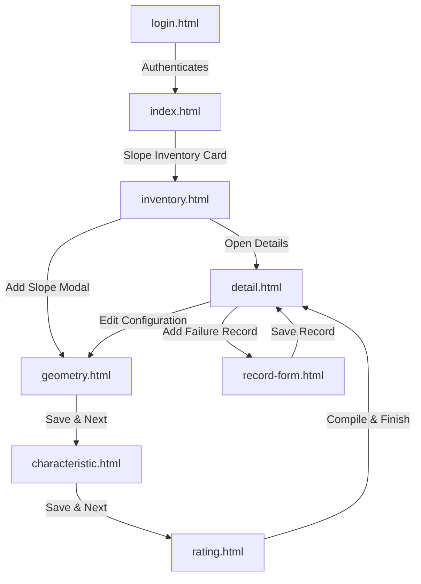

# SRMS Prototype — User Guide & Architecture Walkthrough

Welcome to the **Slope Risk Management System (SRMS) Interactive Prototype**. This application serves as a high-fidelity visual and functional prototype demonstrating a complete redesign of the Slope Inventory system, backed by a simulated JSON database and real-time engineering calculations.

---

## 🚀 Getting Started

Since this prototype is isolated under the path `d:\Work\Source\SRMS\Prototype SRMS`, you can boot up the local server by running the following commands in your terminal:

```bash
# 1. Navigate to the prototype directory
cd "d:\Work\Source\SRMS\Prototype SRMS"

# 2. Install Node.js dependencies
npm install

# 3. Start the mock database & API server
npm start
```

Once started, open your browser and navigate to:
👉 **[http://localhost:3000](http://localhost:3000)**

---

## 🔑 Prototype Credentials

*   **Username / Email**: `malik@gwadestek.com`
*   **Password**: `maulana45`

*Note: Entering these credentials on the Sign In page will simulate a valid session, storing your user data in local storage and redirecting you to the Main Portal Dashboard.*

---

## 🎨 Redesigned Pages & Navigation Map



### 1. Main Dashboard Portal (`index.html`)
A premium landing page incorporating a clean glassmorphism status banner showing real-time system counts:
*   **Hero Carousel**: Auto-fades quotes and system highlights every 5 seconds.
*   **System Health Beacon**: Pulsing live check indicator showing normal operations.
*   **Launcher Grid**: 6 beautiful module cards featuring vector illustrations. Selecting **Slope Inventory** launches the CRUD workspace.

### 2. Slope Management Desk (`inventory.html`)
The main repository dashboard allowing you to search, filter, and view all managed slopes:
*   **Live Search & Side Filter**: Instantly search slopes by name/location or filter by Solo/Semarang road side.
*   **Add Slope Modal**: Inline form to quickly register a new slope and start the configuration wizard.
*   **JSON Database**: Fully backed by `db.json` with CRUD operations (read, create, delete).

### 3. Setup Wizard Pages
*   **Step 1: Geometry (`geometry.html`)**: Input dimensional parameters. Calculates feature height dynamically.
*   **Step 2: Visual Characteristics (`characteristic.html`)**: qualitative observations like drainage, setting, and distress signs.
*   **Step 3: Risk Scoring (`rating.html`)**: Instantly compiles geological instability and consequences.

---

## 🧮 Engineering Scoring Algorithms

The server (`server.js`) automatically recalculates risk indices upon wizard completion using the following formulas:

### 1. Cut & Combine Slope Types
*   **Instability Score (IS)**:  
    $$IS = A1 \times A2 \times A3 \times A4 \times A5 \times B1 \times B2$$
*   **Consequence Score (CS)**:  
    $$CS = ((C1 \times C2) + (D1 \times D2)) \times \text{feature\_height}$$
*   **Total Score (TS)**:  
    $$TS = IS \times CS$$
*   **Ranking Score (RS)**:  
    $$RS = TS \times 0.063 \quad \text{(Cut)} \quad \text{or} \quad TS \times 0.090 \quad \text{(Combine)}$$

### 2. Rock Slope Type
*   **Instability Score (IS)**:  
    $$IS = A1 \times A2 \times A3 \times A4 \times B1 \times B2$$
*   **Consequence Score (CS)**:  
    $$CS = ((C1 \times C2) + (D1 \times D2)) \times K \quad (K: \text{Large}=5, \text{Medium}=3, \text{Small}=1)$$
*   **Total Score (TS)**:  
    $$TS = IS \times CS$$
*   **Ranking Score (RS)**:  
    $$RS = TS \times 0.022$$

### 3. Fill Slope Type
*   Instability and consequences are calculated across 3 potential failure modes:
    *   $$IS_n = \text{factors compiled for mode } n$$
    *   $$CS_n = ((C1 \times C2_n) + (D1 \times D2_n)) \times \text{feature\_height}$$
*   **Total Score (TS)**:  
    $$TS = \sum_{n=1}^3 (IS_n \times CS_n)$$
*   **Ranking Score (RS)**:  
    $$RS = TS \times 0.006$$

### 4. Retaining Wall Type
*   **Instability Score (IS)**:  
    $$IS = A1 \times A2 \times A3 \times A4 \times A5 \times B1 \times B2$$
*   **Consequence Score (CS)**:  
    $$CS = ((C1 \times C2) + (D1 \times D2)) \times \text{feature\_height}$$
*   **Total Score (TS)**:  
    $$TS = IS \times CS$$
*   **Ranking Score (RS)**:  
    $$RS = TS \times 0.027$$
